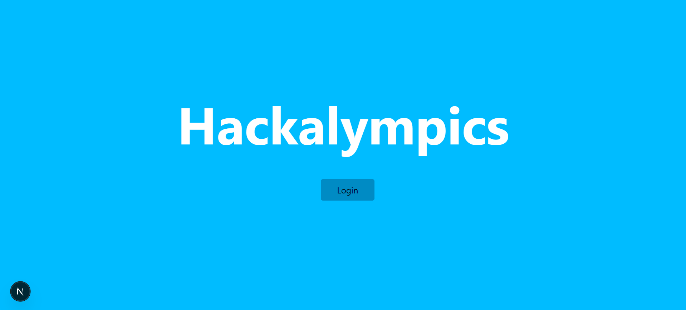
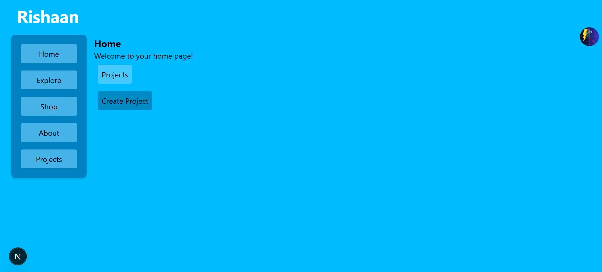
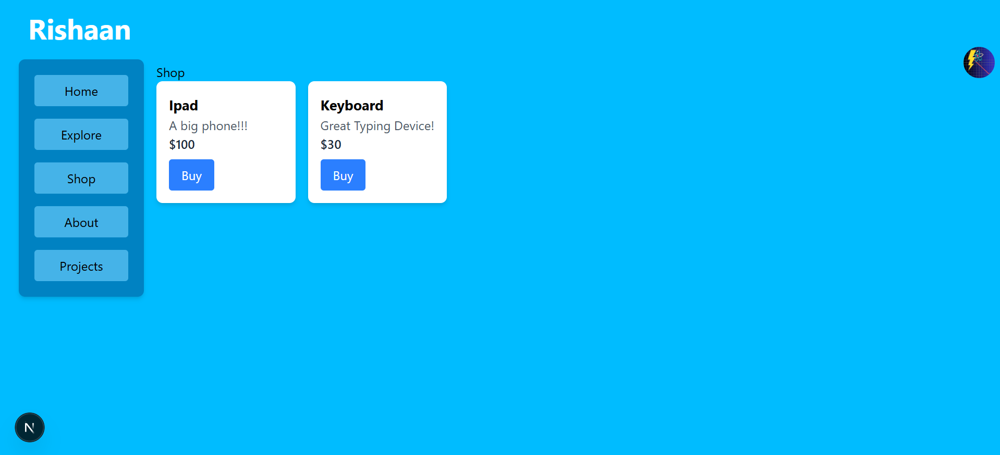
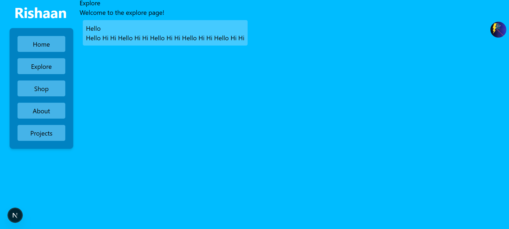
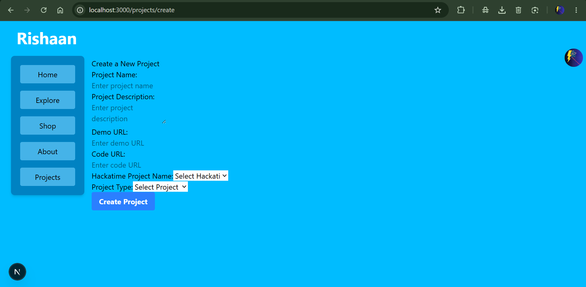

<h1>Hackalympics</h1>
 
 
<h3>Heya! This is the Repository for an Olympics themed hackathon in Tokyo, Japan!</h3>
 
 
<h3>
Firstly! I'd like to tell u a bit about this thing. SO, basically this is gonna ba a Hack Club YSWS (An event with the motive of generating awareness among teens about coding and building cool stuff!!). This will also be followed by an IRL hackathon planned to be in Tokyo, Japan! I'm soooo exited to host this thing! This website is built using NEXT.js and it's my first ever time to use it! SO yea, I leart a lotta new stuff.
</h3>
 
 
<h3>
I've not focused on much of the Styling for this version of the website, but dw, it'll be soon! The main thing i did is, MY FIRST EVER ENTRANCE IN BACKEND!!!. This feels so unreal, but i surely did it!.
</h3>
 
 
<h3>
You can access the website here:
</h3>
 
ysws.rishaan.dev
 
 
<h3>Here's my landing page, ik it's just a minimalistic one, but remember, styling yet to do!</h3>
 

 
 
<h3>The Home page looks like this:</h3>
 

 
 
<h3>The shop works really good! Here is it's glimpse:</h3>
 

 
 
<h3>Explore the projects built by other people on the explore page!</h3>
 

 
 
<h3>Here's the part I worked the most on this whole time, Project Creation:</h3>
 

 
 
<h3>
P.S I also have some pages as a thanks after buying a shop item and stuff, overall I really liked this project and this taught me many things on the way! See ya soon!!! Contact me on slack for assistance, myself @Rishaan!
</h3>
